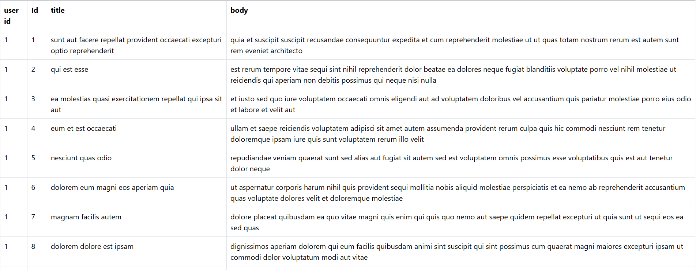

# 📡 Custom API Data Fetching Project

A simple web application that fetches and displays data from a custom API endpoint in a structured table format using HTML, CSS, and JavaScript.

---

## 📖 About the Project

This project demonstrates how to integrate and consume a custom API using JavaScript. The application retrieves data from an API endpoint and dynamically renders it into a table with columns such as User ID, Title, and Body. The main goal of this project is to understand API calls, asynchronous JavaScript (fetch), and DOM manipulation.

---

## 🖼️ Screenshot

---

## ✨ Features

- Fetches data from a custom API endpoint  
- Displays API response in tabular format  
- Dynamic content rendering using JavaScript  
- Clean and readable user interface  
- Error-free API integration  

---

## 🛠️ Technologies Used

- HTML5  
- CSS3  
- JavaScript (Fetch API)  

---

## 📂 Project Structure

